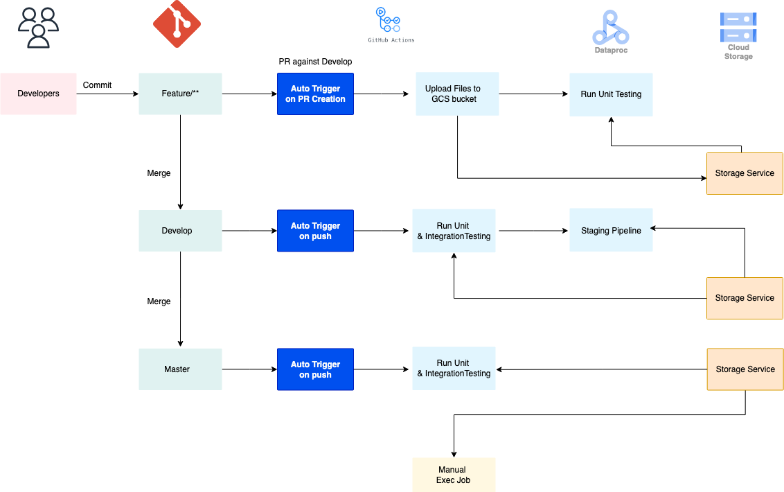

# 🚀 Scalable PySpark Data Pipeline on GCP

This project demonstrates an end-to-end scalable data pipeline built with PySpark on GCP, featuring fully automated CI/CD GitHub actions workflows and job orchestration with Airflow for seamless deployment and testing across staging and production environments

# Solution Architecture



Integrated Apache Airflow with GitHub Actions to orchestrate and automate PySpark batch jobs on Google Cloud Platform.

## CI/CD Workflow

* Trigger a GitHub Actions workflow on PR creation against the develop branch to:

    * Authenticate and set up access to GCP.
    * Upload test data and PySpark scripts to a GCS bucket.

* On merging to the develop branch:

    * GitHub Actions initiates an Airflow DAG that runs both unit and integration tests.
    * On successful validation, the DAG submits the PySpark job to the staging Dataproc cluster.

* After merging to the master branch: GitHub workflow triggers a production Airflow DAG that:

    * Validates code via unit/integration tests.
    * Submits the PySpark job to the production Dataproc cluster.

## Security & Access Control

### Service Accounts

| Service Account           | Permisssions                   |
| ------------------------- |:-------------------------------|
| wkf-oidc                  | Workload Identity User         |
|                           | Service Account Token Creator  | 
|                           | Dataproc Editor                |
|                           | BigQuery Job User              |
|                           | BigQuery Data Editor           |
|                           | Storage Object Admin           |
| composer-service-account  | BigQuery Admin                 |
|                           | Composer Administrator         |
|                           | Composer Worker                |
|                           | Dataproc Editor                |
|                           | Storage Admin                  |
|                           | Service Account User           |


## Project Structure
.
├── source/
│   ├── dataProcessingCode/
│   │   |   |
│   │   │   ├── main/
│   │   │   │   ├── jobs/
│   │   │   │   |     ├── gcs_to_bq/
│   │   │   └── tests/
│   │   │       ├── unit/
│   │   │       └── integration/
|   ├── workflowDag/
├── .github/
│   └── workflows/
└── README.md


## Features

### 1.Google Cloud & GitHub Keyless Authentication

The GitHub action authenticates to google cloud via the `Workload Identity Federation` is recomended over the service account keys that needs to exported to GitHub secrets which is long-lived. 

With GitHub's introudction of OIDC tokens into GitHub action workflows, that enables the user to authenticate from GitHub actions to Google Cloud using `Workload Identity Federation`, by removing the need to long-lived service account key.

[Workload Identity Federation through a Service Account](https://github.com/google-github-actions/auth?tab=readme-ov-file#workload-identity-federation-through-a-service-account)

#### Create a Workload Identity Pool:

```
gcloud iam workload-identity-pools create "github" \
  --project="${PROJECT_ID}" \
  --location="global" \
  --display-name="GitHub Actions Pool"
``` 
#### Get the full ID of the Workload Identity Pool:

```
gcloud iam workload-identity-pools describe "github" \
  --project="${PROJECT_ID}" \
  --location="global" \
  --format="value(name)"
```
This value should be of the format: *projects/123456789/locations/global/workloadIdentityPools/github*

#### Create a Workload Identity Provider in that pool:

🛑 CAUTION! Always add an Attribute Condition to restrict entry into the Workload Identity Pool. You can further restrict access in IAM Bindings, but always add a basic condition that restricts admission into the pool. A good default option is to restrict admission based on your GitHub organization as demonstrated below. Please see the security considerations for more details.

```
gcloud iam workload-identity-pools providers create-oidc "my-repo" \
  --project="${PROJECT_ID}" \
  --location="global" \
  --workload-identity-pool="github" \
  --display-name="My GitHub repo Provider" \
  --attribute-mapping="google.subject=assertion.sub,attribute.actor=assertion.actor,attribute.repository=assertion.repository,attribute.repository_owner=assertion.repository_owner" \
  --attribute-condition="assertion.repository_owner == '${GITHUB_ORG}'" \
  --issuer-uri="https://token.actions.githubusercontent.com"
```
#### Extract the Workload Identity Provider resource name:

```
gcloud iam workload-identity-pools providers describe "my-repo" \
  --project="${PROJECT_ID}" \
  --location="global" \
  --workload-identity-pool="github" \
  --format="value(name)"
```

#### Use this value as the workload_identity_provider value in the GitHub Actions YAML:
```
- uses: 'google-github-actions/auth@v2'
  with:
    service_account: '...' # my-service-account@my-project.iam.gserviceaccount.com
    workload_identity_provider: '...' # "projects/123456789/locations/global/workloadIdentityPools/github/providers/my-repo"
```

#### Grant permission for SA to access gcp resources

```
gcloud secrets add-iam-policy-binding "my-secret" \
  --project="${PROJECT_ID}" \
  --role="roles/secretmanager.secretAccessor" \
  --member="serviceAccount:my-service-account@${PROJECT_ID}.iam.gserviceaccount.com"
```

### 2. CI/CD with GitHub Actions
Automates code validation, file uploads, and job submission to Dataproc clusters. Reduces manual intervention and improves deployment speed.

### 3. Automated Airflow DAG triggering
On push to develop or master, GitHub Actions triggers Airflow DAGs to schedule pipeline runs in staging and production environments.

Staging
```
- name: 'Trigger Staging Airflow DAG'
  run: |
    gcloud composer environments run "${{ env.ENV_NAME }}" \
      --location "${{ env.REGION }}" \
      dags trigger -- "${{ env.DAG_ID }}"
```

Production
```
- name: 'Trigger Production Airflow DAG'
  run: |
    gcloud composer environments run "${{ env.ENV_NAME }}" \
      --location "${{ env.REGION }}" \
      dags trigger -- "${{ env.DAG_ID }}"
```

### 4.Deployment Time Optimization
The overall deployment time has been reduced from 15–23 minutes to approximately 11 minutes. This improvement was achieved by:

The time taken for manual code upload, scripts, tests to gcs bucket and SSH into the dataproc cluster, submit the pyspark jobs manually & monitor them would take around 15-25 minutes.

By integrating GitHub actions with Airflow would automate all these steps and brought down the deployment time to just 11 minutes

Time Saved: (yaje)
Minimum time saved: 15 - 11 = 4 minutes
Maximum time saved: 23 - 11 = 12 minutes
Average improvement: ~40% reduction in deployment time